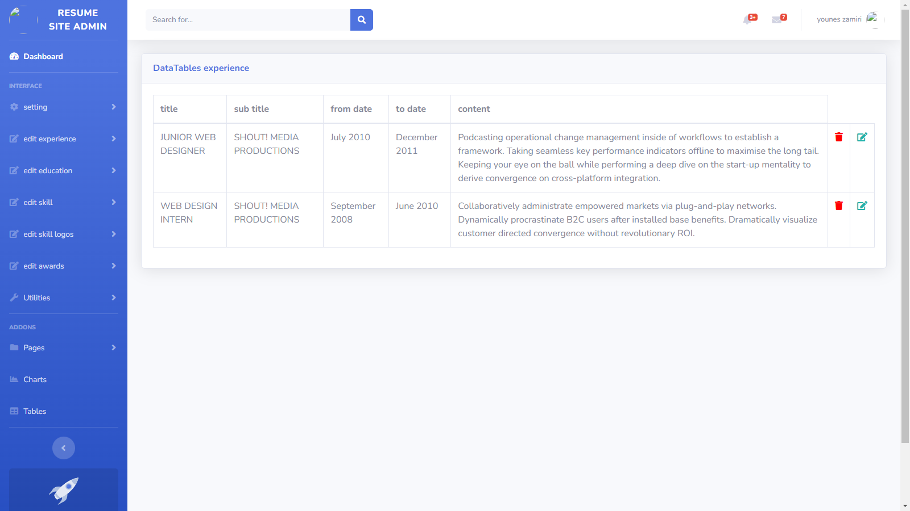

# php-cms
Content Management System (PHP)
A content management system is computer software used to manage the creation and modification of digital content. A CMS is typically used for enterprise content management and web content management.

<b>Installation</b>
  

  1.Install XAMPP 
  2.Download project from github 
  3.copy "resume"(php-cms-main/resume) folder into "C:\xampp\mysql\data" 
  4.copy php "php-cms-main" floder in "C:\xampp\htdocs" 
  5.open xapp control panel and start Apache and MYsql 
  6. open browser and type http://localhost/php-cms-main/ to see site. 
  7.to open "cms" type "http://localhost/php-cms-main/panel/".  
    

<b>Manuals</b>

You can create your personal resume with this panel 
Features of this system: 
1.Add and edit experience 
2.Add and edit education 
3.add and edit awards 
4.add and edit skills 

also you can add your social media address(instagram.twitter.telegram....).  
Make changes in "http://localhost/php-cms-main/panel/" and see the results in "http://localhost/php-cms-main".

